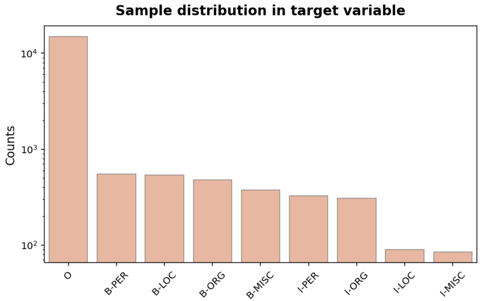
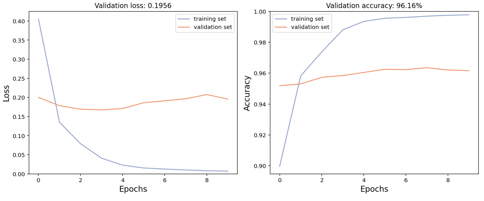
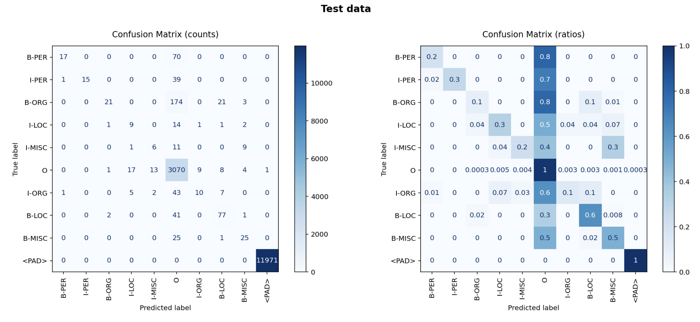
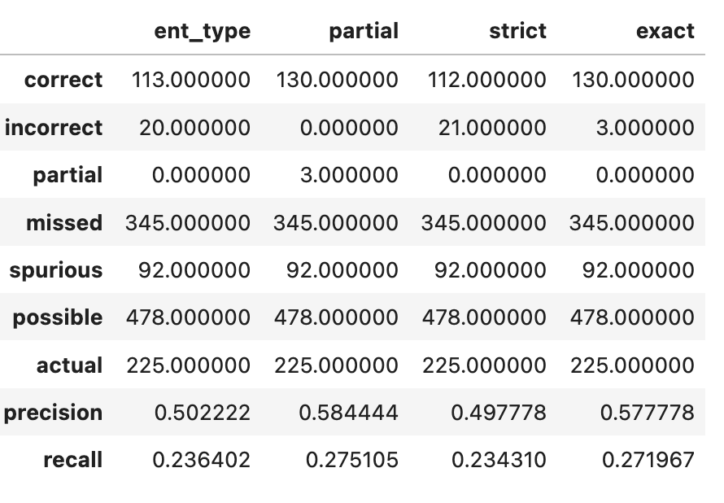

# Named-Entity-Recognition

In this notebook I train a model for Named Entity Recognition using a toy dataset available in the data folder.

The dataset is imbalanced. 

<p align="center"></p>

* The most common named entity class is `O` (84.5% tokens).
* The least common named entity class is I-MISC (0.5% tokens).

Class imbalance can "prevent" a model from "learning" the minority classes reasonably well. I will use confusion matrices to represent the classifier's results. I will also use metrics, such as the f1-score, precision, and recall, better suited to imbalanced datasets (than the accuracy metric).

### Data Preparation for sequence models

When training sequence models, we represent text samples as sequences of tokens of the same length, preserving the word order.

Below, we see how a text sample (and the corresponding labels) looks before and after processing.
```
Example 
-------
Sample:         ['cricket', '-', 'gibbs', 'gets', 'international', 'call', 'up', '.']
Labels:         ['O', 'O', 'B-PER', 'O', 'O', 'O', 'O', 'O']

After processing
----------------
Padded tensor:  [777, 11, 563, 1081, 176, 307, 34, 1, 4457, 4457, 4457, 4457, 4457, 4457, 4457]
Padded labels:  [7, 7, 5, 7, 7, 7, 7, 7, 9, 9, 9, 9, 9, 9, 9] 
```

### Building an NER model using LSTM neural networks

I build a neural network model with an LSTM layer to perform multi-class classification. For the classifier, I used a `Dense` output layer, a softmax activation function and set the number of neurons in the output layer equal to the number of classes. For the loss function, I used sparse_categorical_crossentropy because the targets are integers. Finally, the `Embedding` layer was used to transform the representations of the text samples into an optimal one for this task.

I performed hyper-parameters tuning using grid-search with cross-validation for the following parameters:
* the learning_rate of the optimizer
* the droupout rate
* the embedding size.

Below, we see the accuracy/loss curves for model trained with the "best" hyper-parameters.




### Performance per label type and per token 

I evaluated the model performance per label type and per token two approaches:

* using a mask to avoid counting the `<PAD>` tokens
* using a mask to avoid counting the `<PAD>` and `O` tokens


| Unit        | Accuracy w/o `<PAD>`|Accuracy w/o `<PAD>` and `O` |
| :-------------: | :-----:|:-----:|
| Training set      |  100.0% | 98.0% |
| Validation set    |    90.0% | 36.0% |
| Test set |    86.0% | 27.0% |




### Performance over full named-entity

Source: https://github.com/davidsbatista/NER-Evaluation

When we train a NER system, the most common evaluation method is to measure precision, recall and f1-score at a token level. These metrics are indeed useful to tune a NER system. But when using the predicted named-entities for downstream tasks, it is more useful to evaluate with metrics at a full named-entity level.

This evaluation metrics used below go beyond a simple token/tag based schema, and consider different scenarios based on whether all the tokens that belong to a named entity were classified or not, and also whether the correct entity type was assigned.

<p align="center"></p>

